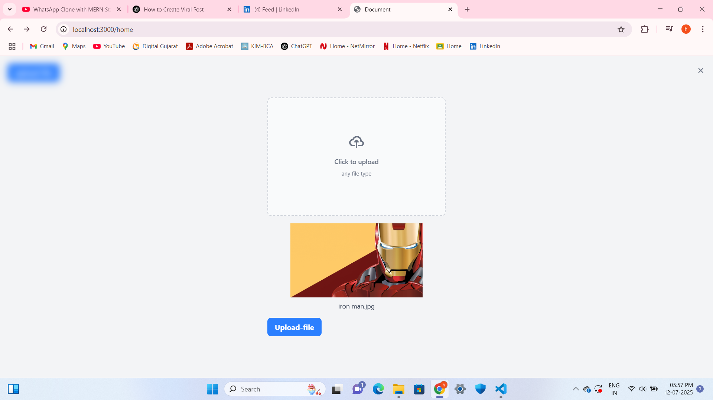

# File Upload Drive (Node.js + EJS + Cloudinary)

A secure file upload system built with Node.js, Express, EJS, MongoDB, JWT authentication, and Cloudinary integration.

---

## 🔧 Features

- ✅ User registration and login with JWT
- ✅ File upload using multer and Cloudinary
- ✅ Drag & drop upload UI
- ✅ File listing and download
- ✅ Delete files from Cloudinary
- ✅ Authenticated routes using cookies

---

## 📦 Tech Stack

- Node.js
- Express.js
- MongoDB (Mongoose)
- Cloudinary
- Multer
- JWT & Cookie-based Auth
- EJS (Server-side templating)
- TailwindCSS + Flowbite (UI)

---

